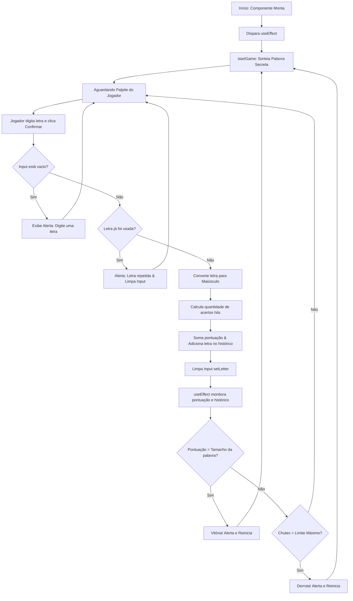

# 🔄 O Fluxo e Lógica do Jogo

Esta seção detalha o fluxo completo do ciclo de vida de uma partida no arquivo `src/App.tsx`, mapeando como a lógica transita desde o carregamento da tela até as telas de fim de jogo.

---

## 🛠️ Estados que controlam o jogo
* `letter` (`string`): A letra atualmente digitada no campo de texto pelo jogador.
* `score` (`number`): A pontuação acumulada do jogador (representa o número de letras corretas já encontradas).
* `lettersUsed` (`LettersUsedProps[]`): O histórico de chutes realizados (contendo a letra e se ela foi correta).
* `challenge` (`Challenge | null`): O desafio atual selecionado, contendo ID, palavra e dica.

---

## 🚀 Passo a Passo Lógico



---

## 📝 Detalhamento das Funções

### 1. Início de Jogo (`startGame`)
Sorteia uma palavra do array `WORDS` (`src/utils/words.ts`) e zera o progresso anterior:
```typescript
function startGame() {
  const index = Math.floor(Math.random() * WORDS.length);
  const randomWord = WORDS[index];

  setChallenge(randomWord);
  setScore(0);
  setLetter("");
  setLettersUsed([]);
}
```

### 2. Confirmação de Chute (`handleConfirm`)
Esta função gerencia todas as etapas e regras do palpite atual:
```typescript
function handleConfirm() {
  if (!challenge) return;

  // Validação 1: Campo vazio
  if (!letter.trim()) {
    return alert("Digite uma letra");
  }

  // Converter palpite para caixa alta
  const value = letter.toUpperCase();
  
  // Validação 2: Letra repetida
  const exists = lettersUsed.find((used) => used.value.toUpperCase() === value);
  if (exists) {
    setLetter("");
    return alert("Letra já utilizada: " + value);
  }

  // Contar quantidade de acertos (letra pode aparecer múltiplas vezes)
  const hits = challenge.word
    .toUpperCase()
    .split("")
    .filter((char) => char === value).length;

  const correct = hits > 0;
  const currentScore = score + hits;

  // Salva no histórico de letras usadas
  setLettersUsed((prevState) => [...prevState, { value, correct }]);

  // Atualiza pontuação do jogo
  setScore(currentScore);

  // Limpa o input
  setLetter("");
}
```

### 3. Monitoramento de Fim de Jogo (`useEffect` e `endGame`)
Um efeito colateral reage sempre que o placar (`score`) ou o total de letras chutadas (`lettersUsed.length`) mudarem. O uso de `setTimeout` de `200ms` é crucial para que a tela atualize a última letra inserida no navegador antes do bloqueio visual provocado pelo `alert()` nativo:
```typescript
useEffect(() => {
  if (!challenge) return;

  setTimeout(() => {
    // Caso 1: Jogador acertou todas as letras da palavra
    if (score === challenge.word.length) {
      return endGame("Parabéns, você venceu!");
    }

    // Limite calculado: tamanho da palavra + tentativas extras de erro (6)
    const attemptLimit = ATTEMPT_MAX + challenge.word.length;

    // Caso 2: Jogador estourou o limite de chutes
    if (lettersUsed.length === attemptLimit) {
      return endGame("que pena, não foi dessa vez =/");
    }
  }, 200);
}, [score, lettersUsed.length]);

function endGame(message: string) {
  alert(message);
  startGame(); // Zera o estado e inicia novo desafio
}
```
