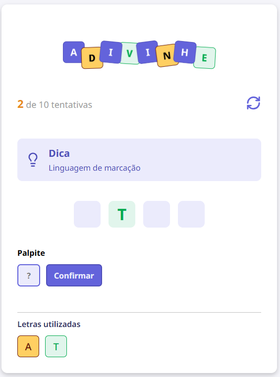

# 🎮 Jogo de Adivinhação - React + TypeScript


Um jogo interativo de adivinhação de palavras com dicas e histórico de palpites, construído para praticar conceitos fundamentais do React 19, TypeScript e escopo isolado de estilização com CSS Modules.

---

## 🔍 Preview do Jogo

<div align="center">
  
</div>

---

## 🚀 Como Executar o Projeto

Certifique-se de ter o [Node.js](https://nodejs.org/) instalado em sua máquina.

1. **Clone o repositório:**
   ```bash
   git clone https://github.com/clara-nascie/jogo-de-adivinha--o---react.git
   ```

2. **Acesse a pasta do projeto React:**
   ```bash
   cd jogo-de-adivinhação-react
   ```

3. **Instale as dependências:**
   ```bash
   npm install
   ```

4. **Inicie o servidor de desenvolvimento do Vite:**
   ```bash
   npm run dev
   ```

5. **Abra no navegador:**
   Acesse o endereço exibido no terminal (geralmente [http://localhost:5173](http://localhost:5173)).

---

## 📚 Documentação Detalhada

Criamos uma documentação modular completa detalhando o processo de criação de cada parte do projeto. Você pode acessá-la através dos links abaixo:

* **[Índice de Documentos](./jogo-de-adivinhação-react/DOCS/README.md)**: Apresentação da documentação.
* **[Tecnologias Utilizadas](./jogo-de-adivinhação-react/DOCS/tecnologias.md)**: Detalhes de arquitetura e boas práticas.
* **Componentes de Interface (Áreas):**
  * **[1. Header (Cabeçalho)](./jogo-de-adivinhação-react/DOCS/componentes/header.md)** Placar e botão de reiniciar.
  * **[2. Tip (Dica)](./jogo-de-adivinhação-react/DOCS/componentes/tip.md)** Exibição da dica dinâmica.
  * **[3. Word Area (Área da Palavra)](./jogo-de-adivinhação-react/DOCS/componentes/word-area.md)** Ocultação e revelação das letras.
  * **[4. Guess Area (Área de Palpite)](./jogo-de-adivinhação-react/DOCS/componentes/guess-area.md)** Input controlado e envio.
  * **[5. Letters Used (Letras Utilizadas)](./jogo-de-adivinhação-react/DOCS/componentes/letters-used.md)** Histórico de chutes com cores.
* **[Fluxo de Jogo Completo](./jogo-de-adivinhação-react/DOCS/fluxo-jogo.md)**: Fluxo lógico passo a passo (Diagrama e funções).
